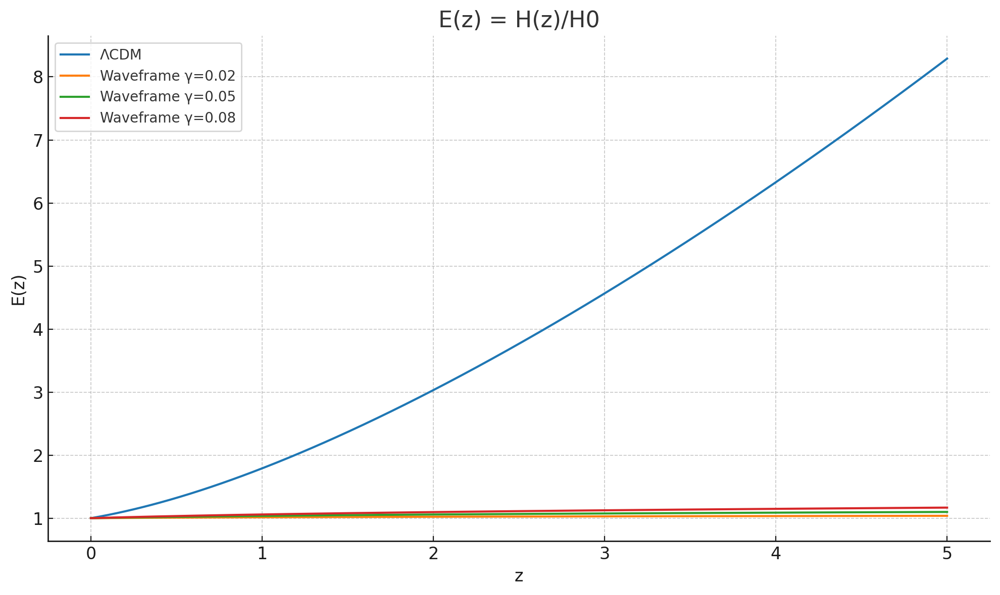

# Waveframe v4.0: AI-Orchestrated Proof of Concept in Cosmology


[](https://doi.org/10.5281/zenodo.16872199)
[](./LICENSE)
[](./LICENSE-NC.md)
[](./CITATION.cff)

---

## Status

This repository (Waveframe v4.0) is **frozen as a completed research project**.  
The work is permanently recorded via DOI for reproducibility.  
All future development will continue in Waveframe v5.0.


---

## What This Is

Waveframe v4.0 is a **proof-of-concept research project** built to test how  
**Aurora Workflow Orchestration (AWO)** can manage a complex, ambiguous scientific domain.

The project explores an entropy–action expansion framework as an alternative to ΛCDM,  
but the physics content is **secondary**. The real aim is to demonstrate:

- how multi-threaded AI collaboration + human validation can handle complexity,  
- how reproducibility and falsifiability can be wired into an AI-driven workflow,  
- how to package outputs (figures, notebooks, logs) into a version-controlled, auditable repo.

Think of Waveframe v4.0 not as a final cosmology theory, but as a **case study** showing that  
AI-assisted research can be structured, documented, and shipped in the same way as serious software.

<p align="center">
  
</p>

*Figure: Expansion history E(z) = H(z)/H₀ compared between ΛCDM and several Waveframe parameterizations.*

---

## Skills Demonstrated

- **Parallel AI Thread Management** — derivations, predictions, and documentation streams  
- **Human-in-the-Loop Validation** — refining AI outputs for accuracy and coherence  
- **Numerical Modeling & Analysis** — comparing Waveframe predictions to ΛCDM  
- **Reproducibility & Documentation** — version-controlled, auditable repository  

---

## Orchestration (AI-Assisted Development)

Waveframe v4.0 was developed through **parallel prompt streams, targeted critiques, and human-in-the-loop gating**.  
The orchestration process is documented in detail in `ORCHESTRATION.md` and supported by logs in `/Docs/`.  

This demonstrates **AI Workflow Design**: transforming ambiguous research goals into reproducible, auditable artifacts.

---

## Overview of the Model

Waveframe v4.0 replaces metric-first assumptions with an **entropy–action, observer-driven expansion law**.  
The project was developed through iterative inputs, critiques, and synthesis — managed like parallel R&D streams — and packaged into an explicit, testable framework.

**Core Tenets**:
1. **Observer-defined horizons** replace a single global geometry  
2. **Spacetime is emergent** rather than fundamental  
3. **Entropy = Horizon Area**, S(t) = π / [H(t)]²  
4. **Expansion emerges** from resolution-dependent information intake, H(t) ∝ 1 / √(t − t₀)  
5. **Field equations → Information-action principle**  
6. **Metric tensor → Entropic structure** tied to causal boundaries  

---

## Research Goals

- Show that an AI-orchestrated workflow can produce a coherent cosmological framework  
- Derive cosmological observables from an entropy-first, observer-limited perspective  
- Recover ΛCDM behaviors in the correct limits  
- Predict measurable deviations in CMB, BAO, and structure growth  
- Package results in a transparent, reproducible repository  

---

## Falsifiability Criteria (Workflow Scaffold)

This section is not meant as a final physics validation.  
Instead, it demonstrates how **falsifiability can be wired into an AI-orchestrated workflow**.  
Each line is a **pass/fail check** — the details can be filled in or revised later,  
but the structure shows how reproducible science can be packaged in a repo.

Key scaffolds:

1. **BBN Constraints** – match ΛCDM within ≈5% for T ~ 0.1–10 MeV  
   *(included as a placeholder for early-universe checks)*

2. **CMB Acoustic Peaks** – reproduce ΛCDM angular scales at z ~ 1100  
   *(workflow notes how this would be tested, even if not fully implemented here)*

3. **Distance–Redshift Relation** – compare SN Ia and BAO curves to ΛCDM  
   *(notebooks generate example figures, showing how checks would run)*

4. **Growth of Structure** – track fσ₈(z) against RSD/weak lensing  
   *(scaffolded with synthetic or sample data for demonstration)*

5. **Limit-Case Recovery** – ensure parameters reduce Waveframe to ΛCDM in the correct limits  
   *(a workflow test, not a full physics proof)*

6. **Unique Predictions** – at least one parameterization diverges measurably from ΛCDM  
   *(workflow demonstrates how to flag and log this)*

---

### Why This Matters

The **point isn’t correctness of the cosmology** —  
it’s that the workflow explicitly defines *how* correctness would be tested,  
turning fuzzy research ideas into **auditable, reproducible criteria**.

## Empirical Predictions (Audit-Ready)

This section makes Waveframe’s claims **attackable** on real data. Each observable has:
- a target deviation window vs ΛCDM,
- the dataset used to test it,
- links to the exact notebook and figure that produce the number.

> Full details live in [`Docs/Empirical_Predictions.md`](Docs/Empirical_Predictions.md).

| Observable | z / range | Waveframe vs ΛCDM (Δ target) | Dataset to test | Notebook | Figure | Status |
|---|---|---:|---|---|---|---|
| Distance modulus μ(z) (SN Ia) | 0–1.5 | ≤ 0.03 mag RMS | Pantheon+/DES | `Notebooks/sn_distance_modulus.ipynb` | `Figures/sn_residuals.png` | ☐ Pending |
| Expansion history E(z)=H/H₀ | 0–2 | ≤ 3% | BAO chronometers | `Notebooks/hubble_Ez_compare.ipynb` | `Figures/Ez_comparison.png` | ☐ Pending |
| Growth fσ₈(z) | 0–1 | within −2% … +4% | RSD (BOSS/eBOSS, DES) | `Notebooks/growth_fsigma8.ipynb` | `Figures/fs8_tracks.png` | ☐ Pending |
| CMB acoustic scale θ\* | z≈1100 | ≤ 0.3% | Planck 2018 | `Notebooks/cmb_theta_star.ipynb` | `Figures/theta_star.png` | ☐ Pending |
| Angular diameter distance D_A(z\*) | z≈1100 | ≤ 1% | Planck 2018 | `Notebooks/cmb_distances.ipynb` | `Figures/DA_recomb.png` | ☐ Pending |

**Interpretation rule:** if best-fit parameters violate any row’s window → model configuration is **falsified**.  

---

## Deliverables in This Repository

- `/Theory` – Conceptual framework and derivations  
- `/Equations` – Final equations with assumptions and constraints  
- `/Notebooks` – Python analysis scripts for model-vs-ΛCDM comparisons  
- `/Analysis` – Results summaries, comparisons, figures, CSV outputs  
- `/Figures` – Generated plots (E(z), D_A(z), growth factor)  
- `/Docs` – Supporting documentation (framework, falsifiability, workflow log, version history)  
- `/Demos` – Streamlit app, report generator, and pipeline templates  
- `/decisions` – Architecture Decision Records (ADRs) capturing key tradeoffs and rationale
- Licensing & attribution documents  

## Decisions

Key tradeoffs and rationale are documented in the [/decisions](./decisions) folder as **Architecture Decision Records (ADRs)**.  
Each ADR captures the context, decision, status, and consequences — ensuring the workflow is transparent and auditable.

---

## Method Limitations

- All calculations are custom; no CAMB/CLASS solvers yet  
- CMB/BAO predictions are distance-only proxies  
- The model is not a replacement for ΛCDM, but a **workflow demonstration**  

---

## Demos

Lightweight demos illustrate how the workflow can be extended:

- `streamlit_app.py` — interactive dashboard plotting entropy vs. redshift  
- `report_generator.py` — converts analysis CSVs into a formatted report  
- `pipelines/langflow_waveframe_template.json` — orchestration starter template  

Run locally:  
```bash
pip install -r Demos/requirements.txt
streamlit run Demos/streamlit_app.py
```

---

## Related Works

- Wright, S.C. (2025). *Waveframe v3.1: Entropic Cosmology with Observer Horizons* (Zenodo: doi.org/10.5281/zenodo.16800001).  
- Wright, S.C. (2025). *Waveframe v2.0: Horizon-Limited Entropic Geometry* (Zenodo: doi.org/10.5281/zenodo.16700001).  
- Tegmark, M. (2014). *Our Mathematical Universe*.  
- Verlinde, E. (2011). *On the Origin of Gravity and the Laws of Newton*.  
- Bousso, R. (2002). *The Holographic Principle*.  
- Susskind, L. (1995). *The World as a Hologram*.  
- Barrow, J.D. (1988). *The World Within the World*.  

---

## Portfolio Note

This repository is part of a three-project portfolio demonstrating  
**AI Workflow Orchestration (AWO)** applied across domains:

- **[AI Workflow Orchestration (AWO)](https://github.com/Wright-Shawn/AI-Workflow-Orchestration)**  
  Flagship method repo — defines the orchestration framework.

- **[Customer Review Analysis](https://github.com/Wright-Shawn/Customer-Review-Analysis)**  
  Applied business demo — sentiment + theme extraction with validation and reproducibility.

- **[Waveframe v4.0](https://github.com/Wright-Shawn/Waveframe-v4.0)**  
  Research case study — applying orchestration to a frontier scientific problem.

Together these repos demonstrate that AWO can scale from business analytics  
to advanced research — **handling complexity with structure, documentation, and reproducibility.**

---

## Closing Note

Waveframe v4.0 should be read as a **workflow demonstration**, not a finished physics theory.  
The cosmology model is exploratory; the real contribution is showing how **AI Workflow Orchestration (AWO)** can structure complex, uncertain research into a reproducible, auditable project.  

---

## Licensing & Attribution

- **Code**: Apache License 2.0 (`LICENSE`)  
- **Theory, equations, figures, docs**: CC BY-NC 4.0 (`LICENSE-NC.md`)  

Attribution is required. Commercial use prohibited without permission.  
See `LICENSE_POLICY.md` for scope examples.  


---

## Author

**Shawn C. Wright**  
[](https://orcid.org/0009-0006-6043-9295) 

---

## Version & Citation

**Version:** Waveframe v4.0 (archived)  

**Concept DOI (permanent citation):**  
[](https://doi.org/10.5281/zenodo.16872199)  

For reproducibility, always cite the **concept DOI** above.  
This ensures future readers resolve to the correct archived version.  

---

## How to Cite

If you use this work, please cite it as:

```bibtex
@software{wright_waveframe_v4_2025,
  author       = {Shawn C. Wright},
  title        = {Waveframe v4.0: AI-Orchestrated Proof of Concept in Cosmology},
  year         = {2025},
  publisher    = {Zenodo},
  version      = {v4.0},
  doi          = {10.5281/zenodo.16872199},
  url          = {https://doi.org/10.5281/zenodo.16872199}
}

Wright, S. C. (2025). Waveframe v4.0: AI-Orchestrated Proof of Concept in Cosmology (v4.0) [Research tool]. Zenodo. https://doi.org/10.5281/zenodo.16872199
